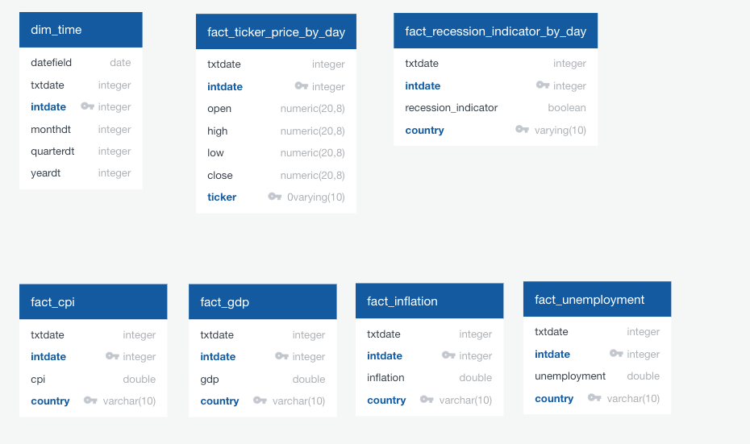

<<<<<<< DB-Commits

=======
# Predictive-Market-Analyzer
<<<<<<< DB-Commits

=======
### Project Contributors
- Lesley Kirchman 
- Raul Celorio 
- Ping Lin
- Nicholas Lambert

## Project Overview
In discussing potential topics for our final project, our group concluded that taking a look at current events would provide the most interesting and relevant project and challenge. Ultimately, it was decided that we would take a look at the state of the stock market in general around the time of the 1970's and analyze the correlation between the state of the market and the presence of a recession to determine how we may utilize that information in the present. 

Our goal is to utlize the tools we have at our disposal to develop an algorithm which will be able to predict the trajectory of our market based on COVID 19 and trends from the past. One of the questions we hope to answer is whether or not one  can predict the length of this current downturn due to the Pandemic by looking for clues in economic and market data from our historical periods.

## Data Sources and Technologies Used

### Relational Database
The team will use an AWS hosted Postgres database. Below is an ERD diagram and short description of the tables. 
 
    * Tables
        * dim_time - Time dimension table to convert day,month, quarter and year.
        * fact_cpi - Consumer Price Index (CPI) information as published by the Federal Reserve. 
        * fact_gdp - Gross Domestic Product (GDP) information as published by the Federal Reserve.
        * fact_inflation - Inflation percentage as published by the Federal Reserve.
        * fact_unemployment - Unemployment percentage as published by the Federal Reserve.
        * fact_ticker_price_by_day - Data sourced from the Wall Street Journal shows open, high, low and close from the Dow Jones Industrial Average, S & P 500 Index and S & P 500 ETF.
        * fact_recession_indicator_by_day - Recession indicator calculated and published byt the Federal Reserve. 

### Data Cleaning and Analysis
**Python** `Pandas` library will be used to *clean*, *prepare* and *explore* the data and perform the initial analysis; 
potentially to fill in/ drop any NaN data, remove redundant columns, create binning, etc.

### Database Storage
**Postgres** is the database we intend to use for storing the data.  Click this link, https://github.com/UCB-Extension-Team-6-Final-2020/Predictive-Market-Analyzer/blob/master/images/DB-ERD.png, for the database design.

#### Data Source and Notes

* Dates of U.S. and international recessions as inferred by GDP-based recession indicator
    * https://fred.stlouisfed.org/series/JHDUSRGDPBR
    * Hamilton, James, Dates of U.S. recessions as inferred by GDP-based recession indicator [JHDUSRGDPBR], retrieved from FRED, Federal Reserve Bank of St. Louis; https://fred.stlouisfed.org/series/JHDUSRGDPBR, May 27, 2020.
 

* Index and ETF Price Information - WSJ
    * Data set provides open, high, low, and close price information. 

### Machine Learning
`SciKitLearn` and `Tensorflow` are the **Mechine Learning** libraries we'll be using.  
The process is to 
1. use **One-Hot Encoder** to understand and evaluate any categorical variables,
2. split our preprocessed data into features and target arrays, and then the training and testing dataset,
3. scale the data,
4. perform either **Logic Regression**, **Support Vector Machine (SVM)**, or **Random Forest**,
5. compare with **Basic Neural Network (1 hidden layer)**, and **Deep Learning Model Design (2 hidden layers)**

### Dashboard
We will utilize **Tableau** for our dashboard to create visuals for data storytelling.  
It will be hosted on *Tableau Public*. 

### Communication
We will meet via Webex 3-4 times per week and then Slack each other in between our meetings.  We are also taking meeting notes and assigning responsibilites to each person at the close of each meeting.

## Final Summary (Results and Potential Applications)
>>>>>>> master
>>>>>>> master
